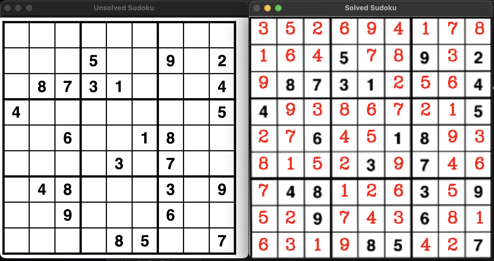

# ```ai-sudoku-solver``` 🧠

### Python implementation of an AI sudoku solver using backtracking. It can be either used as a computer vision solver - processing an input image, running the solver algorithm and output the results in the image, or it can be applied as the backtracking algo tester by using the generator, which instantiates a random valid unsolved sudoku, that is later solved using the same solving technique as for computer vision approach.

#

<p align="center">
  <b>Output of a sample run of the CV implementation:</b>
</p>


<p align="center">
  
</p>

#

## About the Implementation

### Let's introduce the key files stored in ```src/tools``` module that are used in this project and the logic behind their usage.

#

```sudoku_solver.py```:
- Contains the ```SudokuSolver``` class, used for solving detected/generated sudoku grids.
- Sudokus are being solved implementing backtracking algorithm.
- Backtracking algorithm follows these steps:
1. Pick an empty square.
2. Try all numbers.
3. Find the one that matches.
4. Repeat for further sudoku cells.
5. Backtrack (if needed).

#

```image_processing.py```:
- Contains the essential tools for processing an input image that has .
- The functions are invoked in ```main_cv.py``` following the steps:
1. Preprocess the image by resizing and applying filters, such as: grayscale, adaptive threshold, noise removal, etc.
2. Transform the plane to extract the sudoku grid from the image.
3. Classify digits detected in each sudoku cell. The implementation uses the Google's optical chracter recognition (OCR) tool - Pytesseract - for these purposes.
4. Solve the identified sudoku using the previously mentioned ```SudokuSolver```. 
5. Display the solved sudoku in the original image.

#

```grid_generator.py```:
- Contains the ```GridGenerator<``` class, that creates random valid unsolved sudoku grids.
- Sudokus are generated with the simple logic of validating row/column/section.

#

## Running the Code

- Before cloning the remote version of the repo and playing with the code, please make sure that you have ```python3``` and ```pip``` installed on your machine by running the following commands:

```
python3 -V
```

```
pip -V
```

❗ If your shell failed to recognize these commands, please visit [pip](https://pip.pypa.io/en/stable/installation/) and [python](https://www.python.org/downloads/) to find out more about the installation process.

- Otherwise, if you manage to see the versions of ```python3``` and ```pip``` after running the commands, you can clone the whole repo:

```
git clone https://github.com/chizo4/ai-sudoku-solver.git
```

- After cloning it on your machine, please navigate into the root directory of the project and run the bash script to install any needed libraries. Do not worry if you have some of them pre-installed, the script will only install the ones that are missing. Please run the commands:

```
cd ai-sudoku-solver
```

```
bash setup.sh
```

- The next step to follow is to navigate into the ```src``` directory:

```
cd src
```

- Finally, you are able to run the implementation!

- To try out the computer vision version by running the following command. Please note that this approach randomly selects a sample image from the ```assets```. Feel free to modify the code and try it out with your own sudoku images!

```
python main_cv.py
```

- To try out the command line generator version, run:

```
python main_gen.py
```

#

## Contribution & Collaboration

In case you had an idea on how to improve the project in any way, feel free to contact me via of the links included in my [GitHub bio](https://github.com/chizo4) and then you might contribute to the project by creating a new branch with a Pull Request.
