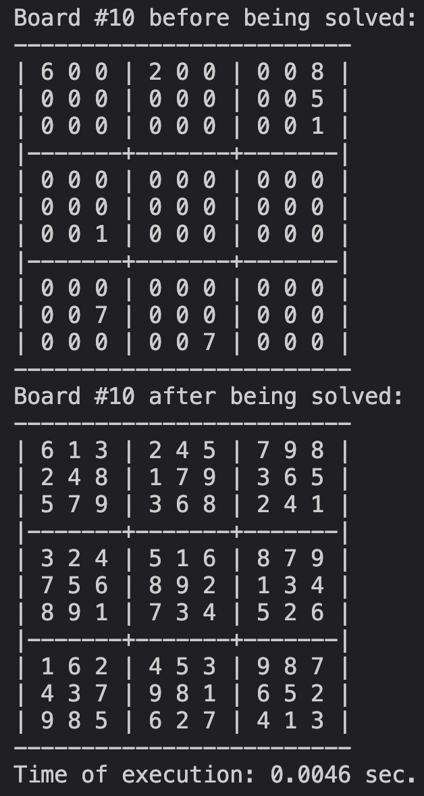

# ```sudoku-solver-backtracking``` 🧠

### Python implementation of an AI sudoku solver with board generator.

#

<b>solver.py:</b>
- contains the <i>SudokuSolver</i> class;
- sudokus are being solved implementing backtracking algorithm;

#

<b>generator.py:</b>
- contains the <i>SudokuGenerator</i> class;
- sudokus are generated with the simple logic of validating row/column/section;

#

<b>main.py:</b>
- the main program to run the application;
- instantiates <i>SudokuGenerator</i> and <i>SudokuSolver</i> classes;
- the main program is run in the command line;

#

### Running the app:

Clone the repo:

```
git clone https://github.com/chizo4/sudoku-solver
```

Navigate to the right directory:

```
cd src
```

Run the file:

```
python main.py
```

##

<p align="center">
  <b>Preview of the main program being run:</b>
</p>


<p align="center">
  
</p>
